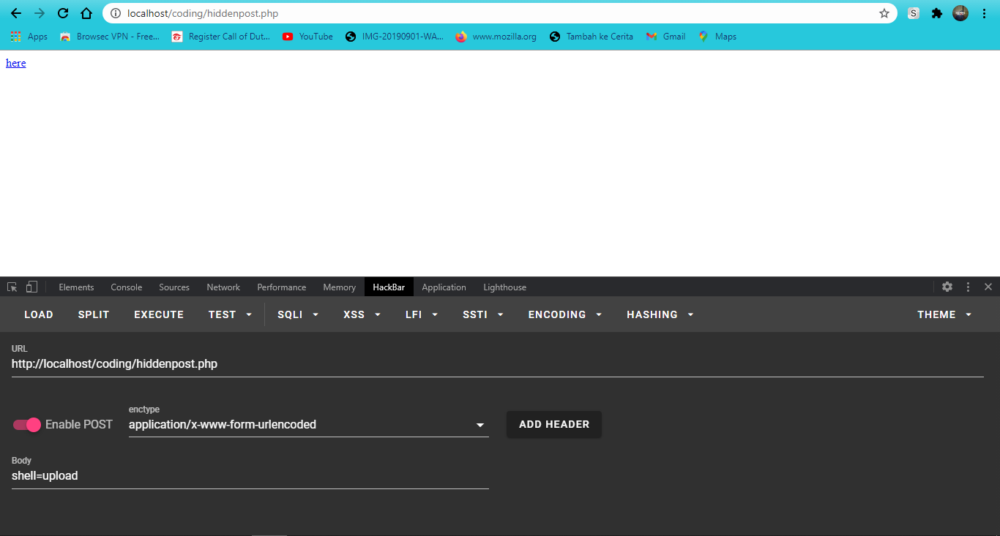

# Hidden POST Request Shell Command

## How To Use
  - If Shell : command <b><u>shell=upload</u></b>
  - If CMD (Command Execution) :
      - system function : <b>hidden=cmd&sys=(your command execution)</b>
      - shell_exec      : <b>hidden=cmd&sh=(your command execution)</b>
      - passthru        : <b>hidden=cmd&pst=(your command execution)</b>
      - exec            : <b>hidden=cmd&exe=(your command execution)</b>

## Example Image

